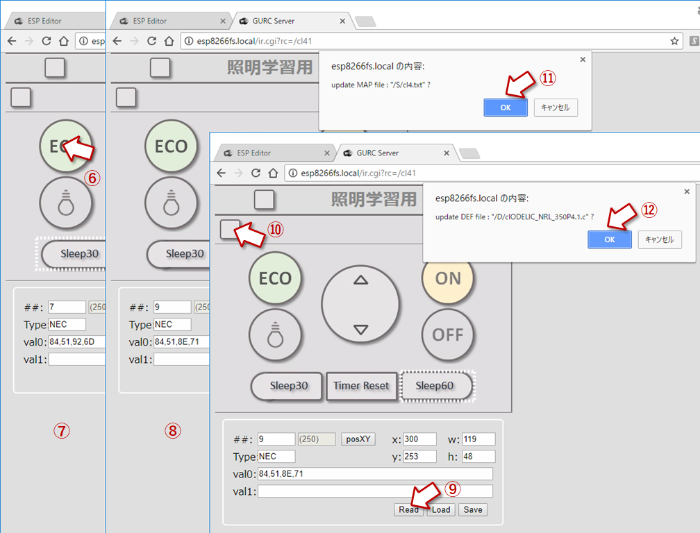

## カスタマイズ・ガイド(2)
### リモコンボタンを増やす
#### 必要なファイルを用意する
例として、照明の「スリープ・タイマー」ボタンの追加で説明する</br>
用意するファイル</br>

 |リモコン定義|画像|画像情報|ボタン情報|リモコン信号|
 |---|---|---|---|---|
 |/cl41.htm|/S/cl4.jpg|/S/cl4.js|/S/cl4.txt|/D/clODELIC_NRL_350P4.1.c|

1. リモコンの定義ファイル

cl31.htmを元にしてcl41.htmを作る</br>


2. 使用する画像を用意する</br>
リモコンに使用する画像(cl3.jpg)をベースにしてボタンを増やした画像(cl4.jpg)を用意する</br>


3. 画像情報ファイル
画像情報ファイル(cl3.js)をベースにして画像に関する情報ファイル(cl4.js)を用意する</br>
（ボタンを追加するために画像の高さを変更している）</br>


4. ボタン領域情報ファイル</br>
ボタン領域情報ファイル(cl3.txt)をベースにボタン情報を追加した領域情報ファイル(cl4.txt)を用意する、
ボタン領域は学習の際にマウスを使って指定が可能であるため、正確でなくてもよいが、他のボタン領域と重ならないように指定


各行の値：[ボタン番号, x, y, w, h],
　領域の左上の座標(x, y)、幅(w)、の高さ(h)

5. 機器別リモコン信号ファイル
各ボタンに対応して送出するリモコン個別データファイルを用意する、内容は学習操作によって更新される</br>


6. 変更した以下のファイルをESPにアップロード
- /cl41.htm
- /S/cl4.jpg
- /S/cl4.js
- /S/cl4.txt
- /D/clODELIC_NRL_350P4.1.c（省略可）

7. リモコン画面を起動
```http
http://192.168.0.23/ir.cgi?rc=/cl41
```


#### リモコンデータを学習させる
現用のリモコンを用意してリモンコン信号を学習させる


1. 「編集モード」ボタンで編集モードにする
2. ボタン番号を入力（7:Sleep 30）
3. 「Load」ボタンをクリックしてボタン領域情報を取り出す
4. "/S/cl4.txt"で適当な値を入力しているために本来のボタン領域とは違う領域が表示される</br>
この領域を正しく指定するために「posXY」をクリック
5. 対応するボタンの領域の左上から右下までドラッグして領域を指定する</br>
x、y、w、h に直接値を入力しても指定できる



6. リモコンデータを読取らせる（学習）（7:Sleep 30、8:Timer reset、9:Sleep 60)
7. 「Read」ボタンをクリックして、現用のリモコンの対応するボタンを押す
8. 同様に追加した３つのボタンを学習させる
9. 
10. 「編集モード」ボタンをクリックして編集モードを終了する
11. 学習したボタン位置情報を保存する
12. 学習したリモコンデータを保存する

以上でボタンを追加したリモコンcl4.htmの完成です。
