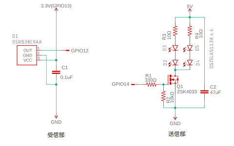

  IRRC32(IRServer32) - ESP32-WROOM-32で赤外線学習リモコン
===========================================================

|①|②|③|
|---|---|---|
||||

ESP32-WROOM-32ボードに赤外線リモコン受信モジュールと赤外線LEDを接続し、学習リモコンにします。</br>
Wi-Fiで接続したスマホやPCなどから操作できます。

## 機能
一般的な「NECまたは家製協フォーマット」の赤外線リモコンに対応します。
- NECフォーマットまたは、家製協フォーマットの信号を学習可能（Sonyフォーマットは未対応）
- リモコン画面もカスタマイズ可能

× 状況に応じて送出信号が変化するエアコンなどでは、信号フォーマットを解析して、対応する信号を合成するための処理を(Javascriptで)書込む必要があります。
  また、３フレーム以上の信号形式（ダイキンエアコンなど）には対応できていません。</br>
× 学習できないリモコン信号があると思われますが、全てのリモコンに対応することはできませんことをご了承の上ご試用ください。</br>

全体概略図


## 導入

#### ハードウェア(付加回路)
|付加部分の回路図|付加回路の実装|
|---|---|
|||

#### ソフトウェア(Arduino)

|スケッチ名|機能|備考|
|---|---|---|
|IRRC32.ino|Webサーバー本体|FSWebServerを改変|
|IRdefs.h|各種設定値||
|ir\_io.ino|赤外線受光、送信処理||
|sr\_cgi.ino|サーバー補助処理||
|mtqq.ino|mqtt処理|

#### スケッチを書込む前に：
IRServerでは、使用する画像、リモコンデータなどを記録するためにESP32-WROOM-32のフラッシュメモリ上に作られたファイルシステム(FFS)を使用します。

#### ソフトウェアの導入手順
1. このリポジトリからファイルをダウンロード
1. Arduinoのスケッチフォルダにダウンロードしたファイルに含まれているフォルダ「IRServer2」をフォルダごとコピー
1. Arduino IDEでスケッチブック内のスケッチ(IRServer2)を開く
1. 「IRServer2.ino」の先頭部分にある下記の３行を環境に合わせて書換える

```IRdefs.ino
const char* ssid = "wifi-ssid";
const char* password = "wifi-password";
```
5. スケッチをコンパイルしてESP32-WROOM-32に書込む
1. 「ツール」⇒「ESP8266 Sketch Data Upload」でIRServer2/dataフォルダ内のリモコンデータをアップロード
1. シリアルモニターを起動
1. 表示されるESP32-WROOM-32に割振られたipアドレスを確認（例では192.168.0.141を仮定）
1. ブラウザから「192.168.0.141/edit」にアクセスできることを確認</br>


###### editの画面
- editはFSWebServerに組込まれているファイルブラウザです、</br>
  ファイルのアップロードやダウンロード、テキストの編集などができます。

## 学習
- リモコンデータ学習</br>
最初のリリースには、シーリングライト、テレビ、エアコンのリモコン画面のサンプルが含まれています。
シーリングライトやテレビであれば、サンプル画面を選んで、現用のリモコン信号を読取らせる（学習）ことで使用するリモコン信号を送出できるようになります。
エアコンでは送出されるリモコン信号が状況によって変わるために読取ったリモコン信号をそのまま送出しても期待した動作にはなりません、これらについては、別途カスタマイズ編で説明します。

- シーリングライトを例に説明します。

1.  使用する画面を選ぶ（cl1、cl2、cl3、cl5）</br>
1. 「ローカル」にある「clxx.htm」ファイルをテキストエディタで編集する</br>
  下記のファイルの```#img = 'cl5'```がリモコン画面に使用する画像ファイルの指定です。</br>
  この指定では```/S/cl5.jpg```を使用することになります。</br>
  （これらファイルは、"Arduinoスケッチフォルダ\IRServer2\data\"フォルダ下にあります）

```cl51.htm
#//
#// cl51.htm
#//
#Sroot      = '/S/' <= 画像関連ファイルを保存しているフォルダ
#Droot      = '/D/' <= リモコンデータを保存しているフォルダ
#title      = '照明学習用'
#name       = 'cl'
#pre_URL    = ''
#now_URL    = '/ir.cgi?rc=cl51'
#nextURL    = ''
#setup      = 1
#<RCmain.htm

#map_start  = 250
// -----------------------------------------------
#title      = '照明'
#name       = 'ODELIC_NRL_350P' <= リモコンデータを保存するファイル名
#data_set   = '1'

#gname      = 'cl'
#img        = 'cl5' <= 使用するリモコン画面の画像ファイル名
#def        = 'STD'

#<RCdefs.htm

#<RCtail.htm
```

3. 学習した赤外線データを保存するファイル名を書換える（例では"ABC\_CL100"）

```Name
Org #name       = 'ODELIC_NRL_350P'
New #name       = 'ABC_CL100' <= 実際のファイル名は"/D/clABC_100.1.c"となります
```
4. 書換えたテキストを名前を付けて保存（例では、"clnew.htm"）
1. ブラウザで「192.168.0.141/edit」にアクセスして、このファイル（"clnew.htm"）をESP32-WROOM-32のFFSにアップロード（「ESP32 Sketch Data Upload」でまるごとアップロードしても良い）
1. ブラウザで「192.168.0.141/ir.cgi?rc=/clnew」にアクセス</br>

 ロード時のログ

```Serial
Connected! IP address: 192.168.0.141
Open http://com16.local/edit to see the file browser
HTTP server started

1>handleFileRead: /living.htm
handleFileRead: /edit.htm
handleFileRead: /index.htm
handleFileList: /
handleFileRead: /favicon.ico
handleFileRead: /cl11.htm
handleFileRead: /cl12.htm
handleFileRead: /cl21.htm
handleFileRead: /cl51.htm
ip:192.168.0.141,mask:255.255.255.0,gw:192.168.0.1
ip:192.168.0.141,mask:255.255.255.0,gw:192.168.0.1
ip:192.168.0.141,mask:255.255.255.0,gw:192.168.0.1
handleFileUpload Name: /clnew.htm
handleFileUpload Size: 458
handleFileList: /
handleFileRead: /clnew.htm
ip:192.168.0.141,mask:255.255.255.0,gw:192.168.0.1
handleFileRead: /clnew.htm
#include: /RCmain.htm:
#include: /RCmain.js:
#include: /S/title.js:
#include: /S/title.jpg:jpeg
#include: /RCdefs.htm:
#include: /S/cl5.js:
#include: /S/cl5.txt:
#include: /D/xxSTD.js:
! sr_error - /D/xxSTD.js:5 - File not found "/D/clABC_CL100.1.c" <= ファイルはまだ作成されていない
#include: /S/cl5.jpg:jpeg
#include: /RCtail.htm:
#include: /S/dummy.jpg:jpeg
```

7. 下図の(1)の「編集モード」ボタンをクリックして編集モードに入る</br>


8. (2)の「ECO」ボタンに対応する赤外線信号を読取り（学習）</br>
  現用リモコンの「ECO」に対応するボタンを押す用意をしてから(3)の「Read」ボタンをクリック</br>
  val0、val1 入力フィールドが灰色の状態になり、読取り状態になったことがわかります、</br>
  この状態で現用リモコンの「ECO」に対応するボタンを押します</br>
  ＊長押しないようにしてください

  「ECO」ボタンに対応する信号を正しく読取った状態


9. 上記の読取り操作を全て（例では全部で６個）のボタンで行い、</br>
  最後に「編集ボタン」をクリックして編集モードを終了する</br>
  学習データの保存ダイアログが表示されるので、「OK」をクリックして保存する（ESP32-WROOM-32上に保存される）


10. 保存された信号データは"clnew.htm"で指定した"/D/clABC\_CL100.1.c"に保存されている</br>
  保存された内容はファイルブラウザで確認できる</br>


11. "clnew.htm"をリロードし、対象の機器に向けて動作するか確認する</br>
  正しく動作すれば、学習手順は完了です、正しく動作しない場合は・・・(^-^;</br>

  このまま使用しても良いですし、複数のリモコンをまとめた複合リモコンを作成することもできます。</br>

  赤外線信号の読取り、データの保存、editでデータの確認、clnew.htmの再起動までのログ</br>

```Serial
IR exe=Read, btn=256, rep=, v0=, v1=  <= 最後の「OFF」ボタンの読取りコマンド

NEC [  67] : 10229+5092
 613+1928  612+1931  613+1930  612+ 663  612+ 657  613+1930  613+1932  612+1939 - E7
 612+ 654  612+ 659  613+1932  612+1934  613+ 656  612+ 661  613+ 658  612+ 671 - 0C
 613+1921  614+1931  612+ 661  613+1933  613+ 659  612+ 658  613+ 661  619+1931 - 8B
 612+ 655  613+ 658  613+1931  612+ 664  612+1927  613+1932  612+1931  612+ 656 - 74
 634+20050 !

IR exe=Update, btn=, rep=, v0=, v1=/D/clABC_CL100.1.c|250|260|　<= 読取った赤外線データの保存コマンド
/D/clABC_CL100.1.c
handleFileRead: /edit.htm <= editのリロード
handleFileRead: /index.htm
handleFileList: /
handleFileRead: /favicon.ico
handleFileRead: /D/clABC_CL100.1.c <= 保存データの確認
handleFileRead: /clnew.htm <= clnew.htmのリロード
#include: /RCmain.htm:
#include: /RCmain.js:
#include: /S/title.js:
#include: /S/title.jpg:jpeg
#include: /RCdefs.htm:
#include: /S/cl5.js:
#include: /S/cl5.txt:
#include: /D/xxSTD.js:
#include: /D/clABC_CL100.1.c:irdata
/D/clABC_CL100.1.c:irdata:250:10 <= 学習したデータでデータベースファイルを更新
250: :''　　　　　　　　　　　　　　　 （内容は先程の学習で更新されたままなので、書換は無い）
250:-:'',
251: :'000707E70CA25D'
251:-:'000707E70CA25D',
252: :'000707E70C8F70'
252:-:'000707E70C8F70',
253: :'000707E70C9B64'
253:-:'000707E70C9B64',
254: :'000707E70C9F60'
254:-:'000707E70C9F60',
255: :'000707E70C9768'
255:-:'000707E70C9768',
256: :'000707E70C8B74'
256:-:'000707E70C8B74',
257: :''
257:-:'',
258: :''
258:-:'',
259: :''
259:-:''
#include: /S/cl5.jpg:jpeg
#include: /RCtail.htm:
#include: /S/dummy.jpg:jpeg
handleFileRead: /favicon.ico
```

## カスタマイズについて
- [カスタマイズガイド(1) IRServerの仕組み](/DOC/IRRC321.md)
- [カスタマイズガイド(2) リモコン画面のボタンを増やしたい](/DOC/IRRC322.md)
- オリジナルな画像のリモコンを作りたい
=> 「リモコン画面のボタンを増やしたい」の画像ファイルが異なるだけで同様にオリジナルリモコンが作れます
- いくつかのリモコンをまとめた複合リモコンにしたい
=> 学習させた各リモコンファイルを繋げるだけです、living.htm、study.htmやbedroom.htmを参考にしてください
- エアコンのコントロールしたい（信号解析、信号生成方法など）<b><=【後日追加予定】</b>

## 変更／修正／訂正
- 2018/11/24 初版

## 参考情報
#### Raspberry piからIRServerに赤外線信号を送出させる

使用例）python irsend.py 192.168.0.141 126
```irsend.py
# -*- coding: utf-8 -*-
import sys
import urllib

args = sys.argv
url = "http://" + args[1] + "/IR?exe=Send&btn=" + args[2]
response = urllib.urlopen(url).read()
print "[" + response + "]"
```

## 参考
- 赤外線リモコンの通信フォーマット http://elm-chan.org/docs/ir_format.html

(c) goji2100.com
